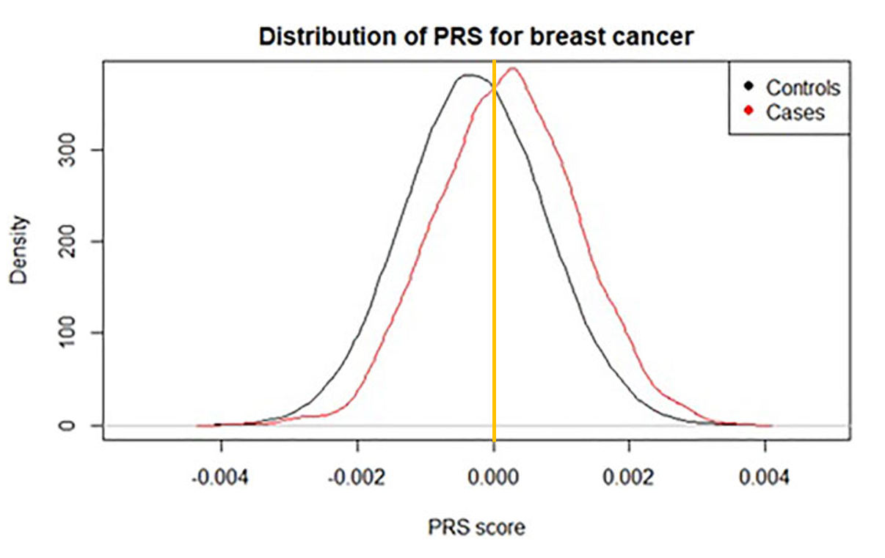
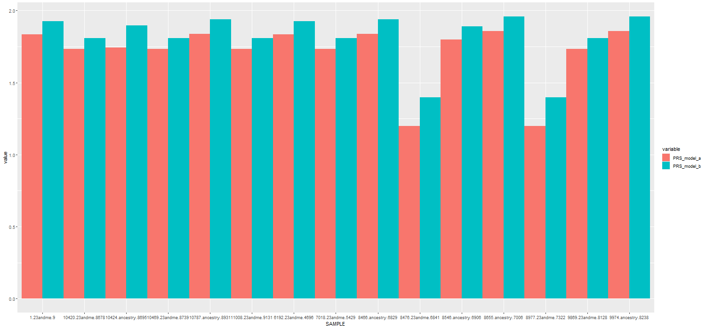
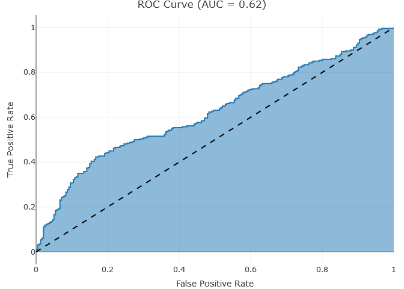

# PRS Evaluation Procedure

## Introduction
The present repository contains a set of tools to perform and evaluate 2 PRS models derived from GWAS Analysis on target data form <b>23andme & ancestry</b>.
The `prs_pipe.sh` has the power to analyze large amount fo samples, determine the sex type of each sample and apply a pre-QC step via plink, perform the PRS and validate both models.
Only for evaluation purpose, without computing the PRS and transform sample formats to vcf, it is enough to run the `Rscript` on `dataframe.txt`. 

**Note:** The distribution plot and ROC Curve hae only demonstrative role, they are not made based on the current data or evaluation.


## Performance

<p align="center">
  
</p>

- The intersection of the 2 distributions (cases and controls) represents the threshold
where higher scores indicate a higher risk (or higher association with a trait).
- The density plots found in the `results/plots`, represents the distributions
of addicted & non-addicted [0,1] classified samples based on 2 PRS models (a and b).

<p align="center">
  
</p>

- Above figure represents the scores obtained by both models on the same test/taget data set

<p align="center">
  
</p>

- The receiver operating characteristic (ROC) curve shows how well the classifier performed on a given dataset. The performance of a classifier is given by how closer to the top left corner is the curve. 
If it's getting in the opposite direction, the less accurate the classifier is. The area under the curve (AUC) determines how well a model predicts classes. 

#### Metrics
* Confusion Matrix
* Accuracy
* Sensitivity
* Specificity
* ROC Curve (AUC) based on labels and model-classification
* p-value: to determine relationship between samples based on classification


## Installation
The tested environment is Ubuntu 20.04.4 LTS having the following specifications. If you are working on a different environment, pleas be aware that a `DockerFile` is available to build the image and run the test in a conatiner.
* Linux - Ubuntu/Debian
* Python (3.8.10 with snps 2.6.0, pandas 1.4.4)
* plink - 1.90b6.26; gawk - 5.0.1

* RUN Docker File:
```
   a######DO not forget abotut docker
```

## Usage
The `prs_pipe.sh` has to be run from repository directory in order to call the other subscripts from `/tool` to perform the analysis
```
  Syntax: ./prs_pipe.sh -f /path/2/vcf-files -a /path/2/model_a -b /path/2/model_b
                        -u /path/2/user_ids.tsv -o /path/2/output [-h] [-r]
  
  required argument:
    -f <vcf folder>    All VCF-samples from 23andme| ancestry
    -o <output folder> Containing plink files and data frames for each sample
    -u <user_ids>      File containing the labeled samples [0,1]
    -a <model_a>       Path to model file A containing SNPS and BETA values
    -b <model_b>       Path to model file B containing SNPS and BETA values
  
  optional arguments:
    -h        help menu
    -r        remove files created by PLINK (default: FALSE)
    -p        run PLINK analysis to quantify MAF adn HWE (default: FALSE)
```

#### Example
- Present Script generates QC reports based on plink and combines all PRS results for both models, into one data frame further use for evaluation.
```
./prs_pipe.sh -f /home/user/prs/vcfs -a /home/user/prs/model_a -b /home/user/prs/model_b -u /home/user/prs/user_ids.tsv -o /path/2//home/user/prs/output -r
```

- The samples present in `user_ids.tsv` can be downloaded from https://opensnp.org/data/ via the following command
```
  $ mkdir data
  $ for i in $(awk '{ print $2}' user_ids.tsv | tail -n +2 | sed 's/[[:blank:]]//g'); do
      wget -O "data/$i" "https://opensnp.org/data/"$i;
  done
```

- Furthermore, each sample can be converted to vcf format via `snps2vcf.py`
```
  usage: Selection [-h] -i I -o O
  
  23andme|ancestry|my heritage to vcf
  
  optional arguments:
    -h, --help  show this help message and exit
    -i I        /path/2/input file
    -o O        /path/2/output prefix for vcf
```

- To the unconverted samples format can be applied the followed cmds (e.g. )
```
  $ gawk -i inplace -F'\t' '{ print $1"\t"$2"\t"$3"\t"$4$5; }' 8655.ancestry.7006
  $ bcftools convert -c ID,CHROM,POS,AA \
                     -s data/8655.ancestry.7006_ --haploid2diploid \ 
                     -f ~/fasta/Homo_sapiens.GRCh37.dna.fa --tsv2vcf 8655.ancestry.7006 \
                     -Oz -o 8655.ancestry.7006_.vcf.gz
```

- The evaluation step can be done independently with the present dataframe containing all PRS results via /tools/Rscript 

```
  Rscript prs_evaluation.R -i "prs_results_dataframe.txt" -o "output/evaluation/"
```

## Samples

caffeine_addiction	|	file_link
--- |	---
1	|	11008.23andme.9131
0	|	10424.ancestry.8695
0	|	10787.ancestry.8931
0	|	10469.23andme.8739
1	|	10420.23andme.8678
1	|	6192.23andme.4696
1	|	9974.ancestry.8238
1	|	9869.23andme.8128
0	|	8977.23andme.7322
0	|	1.23andme.9
1	|	8655.ancestry.7006
1	|	8546.ancestry.6906
0	|	8476.23andme.6841
0	|	8466.ancestry.6829
1	|	7018.23andme.5429


## Contents
* [Introduction](#introduction)
* [Performance](#performance)
* [Installation](#installation)
* [Usage](#usage)
  * [VCF Transformation \- snps2vcf.py](#vcf-transformation---snps2vcf.py)
  * [Syntax \- prs_pipe.sh](#syntax---prs_pipe.sh)
  * [Evaluation](#evaluation)
* [Samples](#samples)
